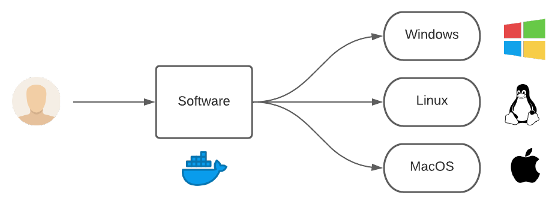
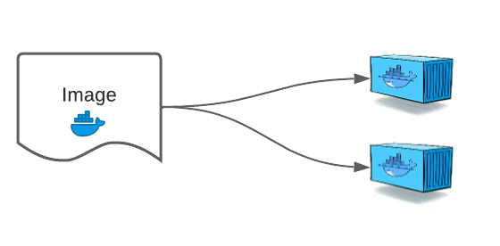

# Introduction to Docker Containers

##### Table of Contents
1. [What is Docker trying to achieve ?](#what-is-docker-trying-to-achieve-)
2. [Installation](#installation)
3. [Docker Image vs Docker Containers](#Docker-Image-vs-Docker-Containers)
4. [Container Identification](#Container-Identification)
5. [Port Binding](#Port-Binding)
6. [Attached and Detached Modes](#Attached-and-Detached-Modes)
7. [Removing Docker Containers](#Removing-Docker-Containers)
8. [Docker CLI Commands](#Docker-CLI-Commands)

## What is Docker trying to achieve ?

Docker is an open platform, once we build a docker container, we can run it anywhere,
say it windows, linux, mac whether on laptop, data center or in cloud.

It follows the build once, run anywhere approach.



## Installation

Install [Docker Desktop](https://www.docker.com/products/docker-desktop/) is the fastest way to containerize applications.

Note that the preferred OS for Docker is Linux.

## Docker Image vs Docker Containers

``Docker Image``: is a file which contains all the necessary dependency and configurations which are required to run an application. Docker images act as a set of instructions to build a Docker container, like a template. Docker images also act as the starting point when using Docker. An image is comparable to a snapshot in virtual machine (VM) environments.

``Docker Containers``: is basically a **running instance of an image**. A Docker container image is a lightweight, standalone, executable package of software that includes everything needed to run an application: code, runtime, system tools, system libraries and settings.

Some container images are already pre-created on [hub docker](https://hub.docker.com/).



## Container Identification

When we create a Docker container, it is assigned a universally unique identifier ``(UUID)``.

These can help identify the docker container among others.

```shell
[root@docker-demo ~]# docker run -dt -p 80:80 nginx
d5187cb1c7f438063e37e0c0c811a437d7b8a49d5beb705711a4e54e99d72d77
```

To help the humans, Docker also allow us to supply container names.

By default, if we do not specify the name, docker supplies randomly-generated name from two words, joined by an underscore.

```shell
[root@docker-demo ~]# docker ps
CONTAINER ID  IMAGE PORTS               NAMES               COMMAND                  CREATED         STATUS
d5187cb1c7f4  nginx 0.0.0.0:80->80/tcp  inspiring_poitras   "nginx -g 'daemon ..."   47 minutes ago  Up 31 minutes
```

By adding ``--name=meaningful_name`` argument during docker run command, we can specify our own name to the container.

```shell
[root@docker-demo ~]# docker run --name mynginx -d -p 8000:80 nginx
d5187cb1c7f438063e37e0c0c811a437d7b8a49d5beb705711a4e54e99d72d77
```

## Port Binding

By default Docker containers can make connections to the outside world, but the outside world cannot connect to containers.

If we want to containers to accept incoming connection from the world, you will have to bind it to a host port.


The following line means all the request to the docker host on port 80 will be redirect to the port 80 of the docker container.

```shell
PORTS
0.0.0.0:80->80/tcp
```

Run ``docker inspect image_name`` will print a json with docker information, see at the bottom the ip details.

## Attached and Detached Modes

When we start a docker container, we need to decide if we want to run in a default foreground mode or detached mode.

``Attached mode``: start the process in the container and attach the console to the process’s standard input, standard output, and standard error.

``Detached mode``: started by the option **--detach** or **–d** flag in docker run command, means that a Docker container runs in the background of your terminal. It does not receive input or display output. Using detached mode also allows you to close the opened terminal session without stopping the container.

## Removing Docker Containers

To stop all containers run ``docker container stop ls -aq``. If you want to remove a container we need to run ``docker container rm name``.

## Docker CLI Commands

Running a docker commands through cli looks like ``docker container COMMAND``.

A list of commands line is available [here](https://docs.docker.com/engine/reference/commandline/container/) or also on this [cheatsheet](0-docker-cheat-sheet.md).

[Back to summary](/README.md)